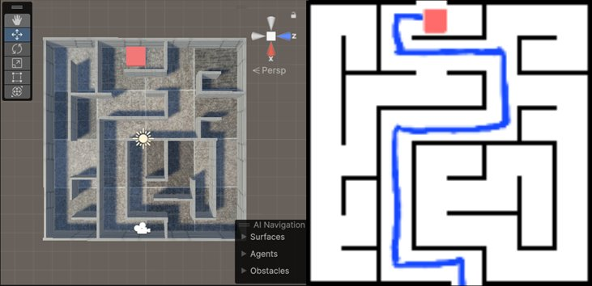
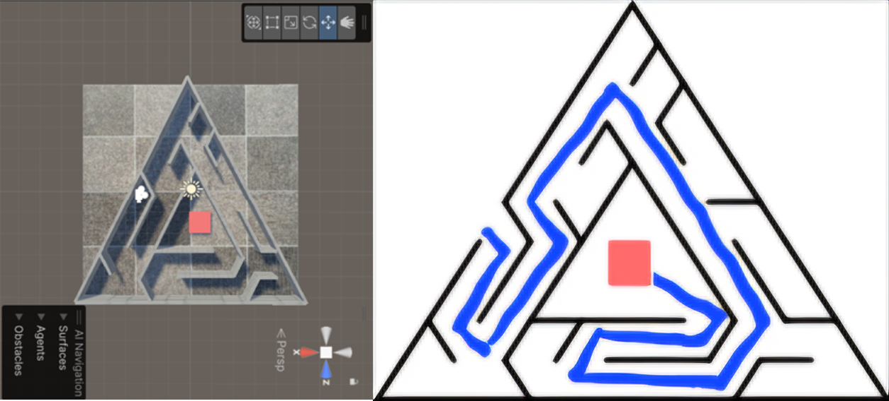

# 🧩 VR Maze Game (Unity)

대학생 시절 제작한 **VR 기반 미로 게임 프로젝트**입니다.
Unity와 Oculus XR 환경을 활용하여 플레이어가 가상 공간에서 미로 공간을 체험할 수 있도록 구현했습니다.

---

## 📌 프로젝트 개요

- **개발 기간**: 2024.03 ~ 2024.06
- **개발 인원**: 1인 프로젝트
- **개발 엔진**: Unity
- **플랫폼**: PC (Oculus / XR 환경)
- **언어**: C#

VR 컨트롤러를 이용하여 플레이어 이동 및 상호작용이 가능하며,
가상 공간에서의 몰입감 있는 탐험 경험을 목표로 제작되었습니다.

---

## 🎮 주요 기능

- 🕹️ VR 플레이어 이동 및 시점 제어
- 🧭 미로 구조 탐험
- 🎯 XR 컨트롤러 기반 상호작용
- 🧱 Unity 물리 시스템 활용 충돌 처리
- 🧑‍💻 Oculus XR 환경 연동

---

## 🛠️ 기술 스택

- Unity Engine
- C#
- Oculus XR Plugin
- XR Interaction Toolkit

---

## 📂 프로젝트 구조

```
Assets/
 ├ Scenes/
 ├ XR/
 ├ EX_OVRPlayerController/
 └ Resources/

Packages/
ProjectSettings/
```

Unity 프로젝트 표준 구조를 따릅니다.

---

## ▶️ 실행 방법

1. Unity Hub 실행
2. 프로젝트 폴더 열기 (`Assets`, `Packages`, `ProjectSettings` 포함된 경로)
3. `Scenes` 폴더 내 Scene 실행
4. Oculus / XR 장비 연결 후 Play

※ 최초 실행 시 Library 폴더가 자동 생성되며 시간이 다소 소요될 수 있습니다.

---

## 💡 프로젝트 의의

- VR 환경에서의 사용자 이동 및 상호작용 구현 경험
- Unity XR 시스템 및 Oculus 연동 이해
- 3D 공간 설계 및 충돌 처리 경험

대학생 시절 진행한 프로젝트로,
현재는 저장 및 보관 목적으로 관리하고 있습니다.

---

## 📸 Preview




---

## ✨ 향후 개선 아이디어

- 뒤에서 쫓아오는 몹 추가
- 시간 제한 추가
- 타이머 및 기록 시스템
- UI 인터페이스 개선
- 다양한 맵 추가

---

## 👤 제작자

**정성민**
GitHub: https://github.com/sungminjung066-lang
